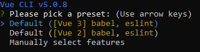
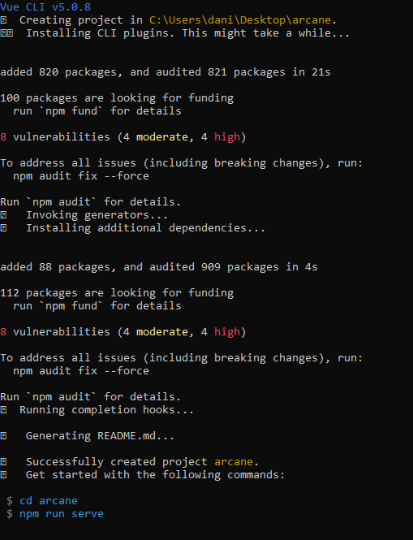
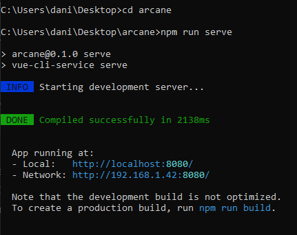
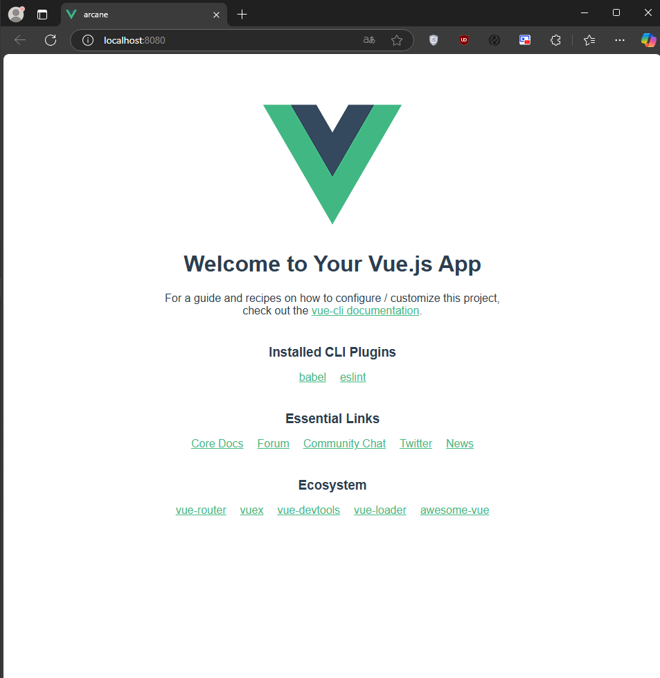
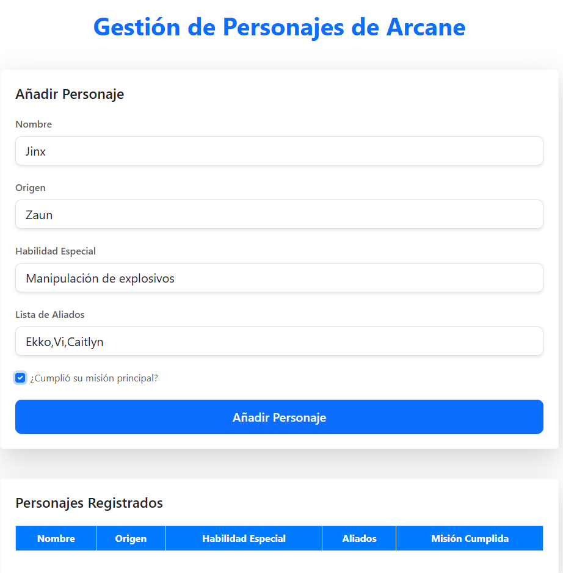
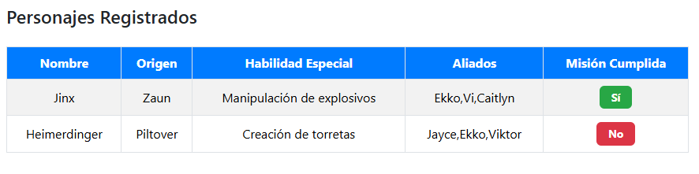

# Mi primera app en vue

## Objetivo
Crea un componente en el que se recopilen y apliquen todos los conceptos trabajados previamente en clase.

## Instrucciones

1. Diseña y desarrolla una aplicación en VueJS con un componente único que cumpla con las siguientes funcionalidades:

    * Formulario para añadir personajes de Arcane:
        - Permite registrar un personaje ingresando:
        - Nombre (Ejemplo: "Jinx", "Vi")
        - Origen (Ejemplo: "Píltover", "Zaun")
        - Habilidad especial (Ejemplo: "Manipulación de explosivos", "Combate cuerpo a cuerpo")
        - Lista de aliados (Ejemplo: "Ekko", "Caitlyn")
        - Checkbox que indique si el personaje ha cumplido su misión principal.
    *Tabla de visualización de personajess registrados:
        -Muestra todos los personajes registrados en el sistema, incluyendo todos los datos ingresados desde el formulario.

2. Requisitos:

    * Realiza toda la gestión de datos de manera volátil, es decir, sin conexión con APIs ni bases de datos. Los datos se gestionarán directamente en el estado del componente.
    * Usa un único componente para combinar las funcionalidades del formulario y la tabla.
    * Haz uso de las directivas necesarias que hemos visto en clase para gestionar la interacción y el comportamiento de los elementos del componente.
    * Consulta la documentación disponible en el campus como referencia para la implementación.
    * Utiliza Bootstrap para proporcionar un diseño visual más atractivo y estructurado a la aplicación.
    * La aplicación deberá ser desarrollada utilizando una de las dos formas vistas en clase: Composition API o Option API.

3. Simplificaciones para esta versión del ejercicio:

    * No se requiere separar las funcionalidades en componentes adicionales, todo debe implementarse dentro de un único componente.
    * El sistema no requiere persistencia de datos ni funcionalidades avanzadas, solo debe manejar los datos de manera local dentro del componente.

    __Nota__ : Este ejercicio sirve como base. Más adelante, añadiremos componentes adicionales y funcionalidades más avanzadas.

    Recuerda comenzar un nuevo proyecto usando vue-cli y usando la opción por defecto Vue 3, Babel y Lint.


## paso 1: creacion del proyecto

Utilizamos el comando vue-cli para crear un nuevo proyecto 
```bash
vue create arcane-app
```
seleccionamos  vue 3



y esperamos a que se termine de crear el proyecto




Al terminar accedemos a la carpeta del proyecto y ejecutamos el comando
```bash
npm run serve
```



Y verificamos su funcionamiento accediendo a la dirección http://localhost:8080/



y por ultimo instalamos la dependencia bootstrap
```bash
npm install bootstrap
```


## paso 2: creación del componente
Creamos un nuevo componente llamado Personajes.vue donde crearemos el formulario y la tabla de visualización de personajes.

### Formulario:
```html
<div class="container mt-5">
      <!-- Título de la Aplicación -->
      <h1 class="text-center mb-5 text-primary">Gestión de Personajes de Arcane</h1>
  
      <!-- Formulario para añadir personajes -->
      <div class="card shadow-lg border-light p-4 mb-5 rounded">
        <h2 class="h4 mb-4 text-dark">Añadir Personaje</h2>
        
        <form @submit.prevent="addCharacter">
          <div class="mb-4">
            <!-- Nombre del personaje -->
            <label for="name" class="form-label text-muted">Nombre</label>
            <input type="text" v-model="newCharacter.name" id="name" class="form-control form-control-lg" placeholder="Ejemplo: Jinx" required />
          </div>
  
          <div class="mb-4">
            <!-- Origen del personaje -->
          <label for="origin" class="form-label text-muted">Origen</label>
          <select v-model="newCharacter.origin" id="origin" class="form-control form-control-lg" required>
            <option value="Aguas Estancadas">Aguas Estancadas</option>
            <option value="Ciudad de Bandle">Ciudad de Bandle</option>
            <option value="Demacia">Demacia</option>
            <option value="El Vacio">El Vacío</option>
            <option value="Freljord">Freljord</option>
            <option value="Islas de las Sombras">Islas de las Sombras</option>
            <option value="Ixtal">Ixtal</option>
            <option value="Jonia">Jonia</option>
            <option value="Noxus">Noxus</option>
            <option value="Piltover">Piltover</option>
            <option value="Shurima">Shurima</option>
            <option value="Targon">Targon</option>
            <option value="Zaun">Zaun</option>
          </select>
        </div>
  
          <div class="mb-4">
            <!-- Habilidad especial del personaje -->
            <label for="specialAbility" class="form-label text-muted">Habilidad Especial</label>
            <input type="text" v-model="newCharacter.specialAbility" id="specialAbility" class="form-control form-control-lg" placeholder="Ejemplo: Manipulación de explosivos" required />
          </div>
  
          <div class="mb-4">
            <!-- Lista de aliados -->
            <label for="allies" class="form-label text-muted">Lista de Aliados</label>
            <input type="text" v-model="newCharacter.allies" id="allies" class="form-control form-control-lg" placeholder="Separados por coma (Ejemplo: Ekko, Caitlyn)" />
          </div>
  
          <div class="form-check mb-4">
            <!-- Checkbox para indicar si cumplió su misión principal -->
            <input type="checkbox" v-model="newCharacter.missionComplete" id="missionComplete" class="form-check-input" />
            <label class="form-check-label text-muted" for="missionComplete">¿Cumplió su misión principal?</label>
          </div>
            <!-- Botón para añadir el personaje -->
          <button type="submit" class="btn btn-primary btn-lg w-100">Añadir Personaje</button>
        </form>
      </div>

```

### Tabla de visualización de personajes:
```html
<!-- Tabla de personajes registrados -->
      <div class="card shadow-lg border-light p-4 rounded">
        <h2 class="h4 mb-4 text-dark">Personajes Registrados</h2>
        <table class="table table-hover table-bordered table-striped">
          <thead class="thead-dark">
            <tr>
              <th>Nombre</th>
              <th>Origen</th>
              <th>Habilidad Especial</th>
              <th>Aliados</th>
              <th>Misión Cumplida</th>
            </tr>
          </thead>
          <tbody>
            <!--utilizamos v-for para iterar sobre los personajes y crear una fila para cada uno-->
            <tr v-for="(character, index) in characters" :key="index">
              <td>{{ character.name }}</td>
              <td>{{ character.origin }}</td>
              <td>{{ character.specialAbility }}</td>
              <td>{{ character.allies }}</td>
              <!-- si el personaje cumplió su misión principal, mostrar "Sí", de lo contrario mostrara "No" -->
              <td><span class="badge" :class="character.missionComplete ? 'bg-success' : 'bg-danger'">{{ character.missionComplete ? 'Sí' : 'No' }}</span></td>
            </tr>
          </tbody>
        </table>
      </div>
    </div>
  </template>
  ```


  En el componente Personajes.vue en el apartado del script, creamos una variable llamada characters que almacenará los personajes que se van a registrar. Luego creamos una función llamada addCharacter que agregará un personaje nuevo a la lista de personajes.

  ```javascript
  export default {
    name: 'App',
    setup() {
        // se crea una variable llamada characters que almacenará los personajes que se van a registrar
      const newCharacter = ref({
        name: '',
        origin: '',
        specialAbility: '',
        allies: '',
        missionComplete: false,
      });

  const characters = ref([]);
  
  // cada vez que se ingresa un personaje en el formulario, se agrega al array characters
  const addCharacter = () => {
    characters.value.push({ ...newCharacter.value });
    newCharacter.value = {
      name: '',
      origin: '',
      specialAbility: '',
      allies: '',
      missionComplete: false,
    };
  };
    
    return {
      newCharacter,
      characters,
      addCharacter,
    };
  },
  ```

  ## paso 3: estilos 

  En Personajes.vue, creamos un estilo CSS para el componente. Este estilo CSS se aplicará a todas las instancias de Personajes.vue.

```css
<style>
/* al body le damos una fuente de Roboto y un fondo de gris */
  body {
    font-family: 'Roboto', sans-serif;
    background-color: #f8f9fa;
  }
  
  .container {
    max-width: 960px;
    margin: 0 auto;
  }
  
  h1 {
    font-weight: 700;
    color: #0d6efd;
    font-size: 2.5rem;
  }
  
  h2 {
    font-weight: 600;
    color: #343a40;
  }
  
  /* creamos un estilo para el formulario */
  .card {
    background-color: #ffffff;
    border-radius: 12px;
    box-shadow: 0 4px 15px rgba(0, 0, 0, 0.1);
  }
  
  .form-label {
    font-weight: 500;
  }
  
  .form-control-lg {
    border-radius: 10px;
    box-shadow: 0 2px 5px rgba(0, 0, 0, 0.1);
  }
  
  .form-check-input {
    border-radius: 5px;
  }
  
  button.btn {
    font-weight: 600;
    padding: 12px;
    border-radius: 10px;
    transition: all 0.3s;
  }
  
  button.btn:hover {
    background-color: #0056b3;
    box-shadow: 0 4px 10px rgba(0, 0, 0, 0.1);
  }
  
  .table th, .table td {
    vertical-align: middle;
    text-align: center;
  }
  
  .table th {
    background-color: #007bff;
    color: white;
  }
  
  .table td {
    background-color: #ffffff;
  }
  
  .table-hover tbody tr:hover {
    background-color: #f1f1f1;
  }
  
  .badge {
    font-size: 0.85rem;
    padding: 8px 15px;
  }
  
  .bg-success {
    background-color: #28a745 !important;
  }
  
  .bg-danger {
    background-color: #dc3545 !important;
  }
  </style>
```
## Vista de la aplicación
Creacion de dos personajes con sus respectivas propiedades.




Ejemplo de como quedaria un personaje con su misión cumplida y otro no cumpliendo.

